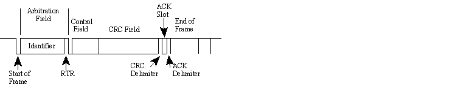

# RC 学习笔记
***

[TOC]

## PID--调参
- [闭环和PID控制，视频](https://www.bilibili.com/video/BV17x411d7XR)
- [RM控制实例讲解](https://www.bilibili.com/read/cv6515031/)
- [Matlab中国讲解的PID算法和误差修正](https://www.bilibili.com/video/BV19U4y1L7Uw/?spm_id_from=333.999.0.0)
- [PID算法实现](https://zhuanlan.zhihu.com/p/468741326)  

1. 先定义PID的结构体
```c
typedef struct {

	/* Controller gains */   //PID系数
	float Kp;
	float Ki;
	float Kd;

	/* Derivative low-pass filter time constant */
	float tau;             //导数低通滤波器时间常数

	/* Output limits */
	float limMin;
	float limMax;
	
	/* Integrator limits */
	float limMinInt;
	float limMaxInt;

	/* Sample time (in seconds) */
	float T;

	/* Controller "memory" */
	float integrator;
	float prevError;			/* Required for integrator */
	float differentiator;
	float prevMeasurement;		/* Required for differentiator */

	/* Controller output */
	float out;

} PIDController;
```

## CAN bus
- [简介](https://blog.csdn.net/CSDN_Yoa/article/details/81384924)
- [CAN协议](https://www.kvaser.cn/about-can/can-protocol-tutorial/)
- [demo代码](https://blog.csdn.net/qq_33693310/article/details/116884820)

### CAN报文（协议层）
#### 数据帧
51 + （0\~64）位 = （51\~117）位  
  
*标准CAN*

  
*拓展CAN*

0. SOF - 起始，显性（0）表示报文开始
1. 仲裁字段ID  
    11位的标志符（拓展模式29位，并包含两个隐性位 SRR,IDE） + 一个支配数据帧的RTR位  
    **标识符注意事项：标识符可以是11位（CAN 2.0A）或29位（CAN 2.0B）。这不完全正确。**
    > 出于与某种老式CAN控制器兼容的原因，标识符不得把7个最高有效位都设置为1。所以，对于11位标识符，只剩下0到2031，29位标识符可以使用532676608个不同的值。注意，所有其它CAN控制器都接受“非法”标识符，所以现代CAN系统标识符2032到2047可以自由使用。

        - RTR 远程发送请求位，当需要从另一个节点请求信息时，此位为显性（逻辑0）。所有节点都能接收这个请求，但是帧标识符确定被指定的节点。响应数据帧同样被所有节点接收，可以被有兴趣的节点使用。  
        - SRR 隐性位，在扩展格式中SRR是固定数值，SRR位永远置1，保证了标准数据帧的优先级高于扩展数据帧。  
        - IDE 隐性位，标识符扩展位为显性（0）时表示这是一个标准CAN格式，为隐形（1）表示这是扩展CAN格式，保证了标准遥控帧优先级高于扩展数据帧。  
1. 数据字段  
    0~8字节(64位)
2. CRC字段  
    16位，包含一个基于报文大部分数据计算得到的15位校验和校验和用于错误检测(15位）+ 定界符（1位）。
3. ACK字段  
    2位，包含应答位和应答界定符。发送节点的报文帧中，ACK两位是隐性位（1)，当接收器正确地接收到有效的报文，接收器会在应答位期间向发送节点发送一个显性位(0)，表示应答。如果接收器发现这帧数据有错误，则不向发送节点发送ACK应答，发送节点会稍后重传这帧数据。
4. EOF字段  
    7位帧结束标志位，全部为隐性位。如果这7位出现显性位，则会引起填充错误。
5. IFS  
    7位帧间隔标志位，CAN控制器将接收到的帧正确的放入消息缓冲区是需要一定时间的，帧间隔可以提供这个时间。

#### 远程帧（遥控帧)
  
远程帧与数据帧十分相似，但是有两个重要的区别：  
- 它被显式标记为远程帧（仲裁字段中的RTR位为隐性）
- 它没有数据字段
> 远程帧的预期目的是征求传输相应的数据帧。例如，如果节点A传输一个仲裁字段设置为234的远程帧，那么节点B（如果已经正确初始化）可能通过一个仲裁字段也设置为234的数据帧进行响应。
> 关于远程帧的一个注意事项：数据长度代码必须设置成预期响应报文的长度。否则仲裁将不起作用。

#### 错误帧
错误帧包含一个错误标志(Error flag)。这个错误标志是6位长的相同值（因此违背位填充规则）和一个错误定界符（8个隐性位）。错误定界符(Error delimiter)提供一些空间，以便总线上其它节点在检测到第一个错误标志时可以发送它们的错误标志。

#### 过载帧
不常用。在格式上，与错误帧相似，并且由会变得重荷的节点传送。据资料，会生成过载帧的唯一一种控制器是现在已经过时的82526。  

### CAN 的物理层
*注意，一些总线收发器不允许低于特定的比特率。*  
#### ISO11898-2
最常见的类型由CAN标准ISO11898-2部分定义的，它是双线平衡信令方案。有时也称为“高速CAN”。
- 最大总线速度: 按照标准，CAN总线的最大速度是1 Mbps。然而，一些CAN控制器能够处理比1Mbps更快的速度，可以在特殊应用场合中使用。
- 最大线缆长度：如果速度为1Mbps，可以使用的最大线缆长度大约为40米（130英尺）。这是因为仲裁方案要求信号的峰值可以到达最远的节点并且在位采样之前再次返回。换言之，线缆长度受光速限制。
> 其它的最大线缆长度是（这些是近似值):
> 100米（330英尺），比特率为500kbps
> 200米（650英尺），比特率为250kbps
> 500米（1600英尺），比特率为125kbps
> 6千米（20000英尺），比特率为10kbps

#### ISO11898-3 
同一个ISO标准的另一部分（ISO 11898-3）为低总线速度定义了另一种双线平衡信令方案。它具有容错能力，所以即使一条总线线缆断开或对地短路或连接到备用电池，信号都可以继续发出。有时也称为“低速CAN”。
- 最大总线速度: 低速CAN最快可以达到125 kbps。 
  
#### 总端端接
> ISO 11898 CAN总线必须进行端接。 通过在总线各端点使用120欧姆的电阻达到这个要求。端接可以达到两个目的：
> 1. 消除总线终端处的信号反射。
> 2. 确保总线获得正确的直流电电平。  

> 不管速度快慢，ISO 11898 CAN总线始终都必须进行端接。我将重复这一点：不管速度快慢，ISO 11898 CAN总线始终都必须进行端接。对于实验性工作，一个端接器可能就已足够。如果没有连接任何端接器，但是您的CAN总线仍然能够正常工作，那么您只是比较幸运而已。
> **注意，其它物理层（例如“低速CAN”、单线缆CAN和其它物理层）不一定需要进行端接。但是您的常用高速ISO 11898 CAN总线总是需要至少一个端接器。**

参考：[Using termination to ensure recessive bit transmission](https://www.kvaser.cn/en/using-termination-ensure-recessive-bit-transmission/)

### 代码code
**配置流程**  
1. 所需结构体
```c
GPIO_InitTypeDef GPIO_InitSturcture;
CAN_InitTypeDef CAN_InitSturcture;
CAN_FilterInitTypeDef CAN_FilterInitSturcture;
```  

2. 配置相关引脚的复用功能，使能CAN时钟，配置GPIO
```c
//使能相关时钟
RCC_AHB1PeriphClockCmd(RCC_AHB1Periph_GPIOA, ENABLE);//使能PORTA时钟	                   											 
RCC_APB1PeriphClockCmd(RCC_APB1Periph_CAN1, ENABLE);//使能CAN1时钟	
	
//初始化GPIO
GPIO_InitStructure.GPIO_Pin = GPIO_Pin_12;
GPIO_InitStructure.GPIO_Speed = GPIO_Speed_50MHz;
GPIO_InitStructure.GPIO_Mode = GPIO_Mode_AF_PP;	//复用推挽
GPIO_Init(GPIOA, &GPIO_InitStructure);			//初始化IO

GPIO_InitStructure.GPIO_Pin = GPIO_Pin_11;
GPIO_InitStructure.GPIO_Mode = GPIO_Mode_IPU;	//上拉输入
GPIO_Init(GPIOA, &GPIO_InitStructure);			//初始化
```  
3. 设置CAN工作模式及波特率等
   
这一步通过先设置CAN_MCR寄存器的INRQ位，让CAN进入初始化模式，然后设置CAN_MCR的其他相关控制位。再通过CAN_BTR设置波特率和工作模式（正常模式/环回模式）等信息。最后设置INRQ为0，退出初始化模式。  
CAN初始化结构体：
```c
typedef struct{
    uint16_t CAN_Prescaler;   
    uint8_t CAN_Mode;         
    uint8_t CAN_SJW;           
    uint8_t CAN_BS1;                 
    uint8_t CAN_BS2;             
    FunctionalState CAN_TTCM; 
    FunctionalState CAN_ABOM;   
    FunctionalState CAN_AWUM;   
    FunctionalState CAN_NART; 
    FunctionalState CAN_RFLM; 
    FunctionalState CAN_TXFP;   
    } CAN_InitTypeDef;
```
> 前面5个参数是用来设置寄存器CAN_BTR，用来设置模式以及波特率相关的参数，设置模式的参数是CAN_Mode（环模式CAN_Mode_LoopBack和普通模式CAN_Mode_Normal，还可以选择静默模式以及静默回环模式测试）。其他设置波特率相关的参数CAN_Prescaler，CAN_SJW，CAN_BS1和CAN_BS2分别用来设置波特率分频器，重新同步跳跃宽度以及时间段1和时间段2占用的时间单元数。后面6个成员变量用来设置寄存器CAN_MCR，也就是设置CAN通信相关的控制位。(翻翻中文参考手册中这两个寄存器的描述)  

初始化实例为：

```c
//CAN单元设置
CAN_InitStructure.CAN_TTCM=DISABLE;			//非时间触发通信模式  
CAN_InitStructure.CAN_ABOM=DISABLE;			//软件自动离线管理	 
CAN_InitStructure.CAN_AWUM=DISABLE;			//睡眠模式通过软件唤醒(清除CAN->MCR的SLEEP位)
CAN_InitStructure.CAN_NART=ENABLE;			//禁止报文自动传送 
CAN_InitStructure.CAN_RFLM=DISABLE;		 	//报文不锁定,新的覆盖旧的  
CAN_InitStructure.CAN_TXFP=DISABLE;			//优先级由报文标识符决定 
CAN_InitStructure.CAN_Mode= mode;	        //模式设置： mode:0,普通模式;1,回环模式; 
//设置波特率
CAN_InitStructure.CAN_SJW=tsjw;				//重新同步跳跃宽度(Tsjw)为tsjw+1个时间单位  CAN_SJW_1tq	 CAN_SJW_2tq CAN_SJW_3tq CAN_SJW_4tq
CAN_InitStructure.CAN_BS1=tbs1; 			//Tbs1=tbs1+1个时间单位CAN_BS1_1tq ~CAN_BS1_16tq
CAN_InitStructure.CAN_BS2=tbs2;				//Tbs2=tbs2+1个时间单位CAN_BS2_1tq ~	CAN_BS2_8tq
CAN_InitStructure.CAN_Prescaler=brp;        //分频系数(Fdiv)为brp+1	
CAN_Init(CAN1, &CAN_InitStructure);        	//初始化CAN1 
```  
4. 设置过滤器（读手册，bxCAN） 
```c
CAN_FilterInitStructure.CAN_FilterNumber=0;	//过滤器0
CAN_FilterInitStructure.CAN_FilterMode=CAN_FilterMode_IdMask; 	//屏蔽位模式
CAN_FilterInitStructure.CAN_FilterScale=CAN_FilterScale_32bit; 	//32位宽 
CAN_FilterInitStructure.CAN_FilterIdHigh=0x0000;	//32位ID
CAN_FilterInitStructure.CAN_FilterIdLow=0x0000;
CAN_FilterInitStructure.CAN_FilterMaskIdHigh=0x0000;//32位MASK
CAN_FilterInitStructure.CAN_FilterMaskIdLow=0x0000;
CAN_FilterInitStructure.CAN_FilterFIFOAssignment=CAN_Filter_FIFO0;//过滤器0关联到FIFO0
CAN_FilterInitStructure.CAN_FilterActivation=ENABLE;//激活过滤器0

CAN_FilterInit(&CAN_FilterInitStructure);			//过滤器初始化

//CAN中断优先级设置
#if CAN_RX0_INT_ENABLE 
	CAN_ITConfig(CAN1,CAN_IT_FMP0,ENABLE);				//FIFO0消息挂号中断允许.		    

	NVIC_InitStructure.NVIC_IRQChannel = USB_LP_CAN1_RX0_IRQn;
	NVIC_InitStructure.NVIC_IRQChannelPreemptionPriority = 0;     // 主优先级为1
	NVIC_InitStructure.NVIC_IRQChannelSubPriority = 0;            // 次优先级为0
	NVIC_InitStructure.NVIC_IRQChannelCmd = ENABLE;
	NVIC_Init(&NVIC_InitStructure);
#endif
	return 0;
```  
5. 发送数据的函数
```c
//can发送一组数据(固定格式:ID为0X12(StdId),标准帧,数据帧)	
//len:数据长度(最大为8)				     
//msg:数据指针,最大为8个字节.
//返回值:0,成功;
//		 其他,失败;
u8 Can_Send_Msg(u8* msg,u8 len)
{	
	u8 mbox;
	u16 i=0;
	CanTxMsg TxMessage;
	TxMessage.StdId=0x12;			// 标准标识符 
	TxMessage.ExtId=0x12;			// 设置扩展标示符 
	TxMessage.IDE=CAN_Id_Standard; 	// 标准帧
	TxMessage.RTR=CAN_RTR_Data;		// 数据帧
	TxMessage.DLC=len;				// 要发送的数据长度
	for(i=0;i<len;i++)
	TxMessage.Data[i]=msg[i];			          
	mbox= CAN_Transmit(CAN1, &TxMessage);   
	i=0; 
	while((CAN_TransmitStatus(CAN1, mbox)==CAN_TxStatus_Failed)&&(i<0XFFF))i++;	//等待发送结束
	if(i>=0XFFF)return 1;
	return 0;	 
}
```  
6. 接受信息的函数
```c
//can口接收数据查询
//buf:数据缓存区;	 
//返回值:0,无数据被收到;
//		 其他,接收的数据长度;
u8 Can_Receive_Msg(u8 *buf)
{		   		   
 	u32 i;
	CanRxMsg RxMessage;
    if( CAN_MessagePending(CAN1,CAN_FIFO0)==0)return 0;		//没有接收到数据,直接退出 
    CAN_Receive(CAN1, CAN_FIFO0, &RxMessage);//读取数据	
    for(i=0;i<8;i++)
    buf[i]=RxMessage.Data[i];  
	return RxMessage.DLC;	
}
```  


## RoboMaster-A
- [大疆官网](https://www.robomaster.com/zh-CN/robo/overview?site=brandsite&from=nav)

## M3508减速直流电机
- [大疆官网，数据，demo](https://www.robomaster.com/zh-CN/products/components/general/M3508)  
- [简介](https://zhuanlan.zhihu.com/p/73376976)

## C620无刷电机调速器
- [官网，与M3508配套使用](https://store.dji.com/cn/product/rm-c620-brushless-dc-motor-speed-controller?from=robomaster_online)